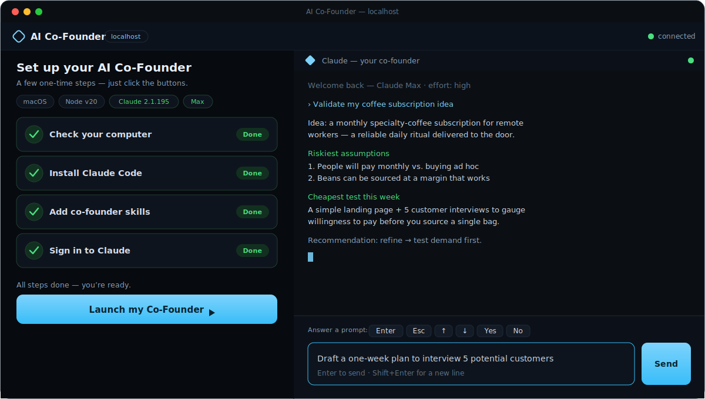

# 🚀 AI Co-Founder (localhost)


Your **AI Co-Founder**: your *own* Claude Code (Anthropic's AI coding/agent tool),
wrapped in a friendly browser UI with business-coaching **skills**. A one-screen
setup wizard installs Claude Code, fixes your PATH, loads the co-founder skills,
and signs you in via your browser — **all with buttons, no terminal knowledge
required**. Then you get an embedded Claude session you talk to through a
**chat-style message box** (you see what you type), plus one-click skill launchers.



> **This runs on your own computer — it is not a website you visit.** You start a
> small local server on your machine and open it in your browser at
> `http://localhost`. That's by design: the app drives *your own* Claude Code,
> installs it for you, and reads your *local* sign-in — none of which a remote web
> page could do. Your credentials are sent **nowhere**; sign-in lives in Claude
> Code's own local store (macOS Keychain / `~/.claude/.credentials.json`), and the
> server listens on `127.0.0.1` only.

> **No extra cost.** It uses the Claude **Pro/Max subscription you already pay
> for** — nothing else. It runs Claude's *interactive* mode (which bills your
> subscription) and **strips any `ANTHROPIC_API_KEY` from the session**, so it
> can't be diverted to pay-as-you-go API charges.

> **Unofficial / not affiliated.** This is an independent open-source project. It
> is **not** affiliated with, endorsed by, or sponsored by Anthropic. “Claude” and
> “Claude Code” are trademarks of Anthropic, used here only to describe what this
> tool wraps. It runs *your own* Claude Code under *your own* subscription and ToS.

---

## What you get

- **One-screen setup wizard** — detects your OS, installs Claude Code via the
  official native installer, fixes your PATH, loads the co-founder skills, and
  signs you in via browser OAuth. All buttons, no terminal knowledge required.
- **Embedded Claude session** — a real interactive `claude` CLI rendered with
  **xterm.js**, running in a private per-session workspace.
- **Chat-style compose box + quick-keys** — type a message and *see* what you
  type; a row of quick-keys (Enter · Esc · ↑ · ↓ · Yes · No) answers Claude's
  prompts without ever clicking into the terminal.
- **One-click skill launchers** — bundled business-coaching skills (e.g. idea
  validation) run with a single click.
- **Your subscription, your machine** — drives interactive `claude` over a PTY so
  it bills your Pro/Max plan; credentials never leave your computer; binds
  `127.0.0.1` only; no telemetry.
- **Resilient** — reload the page and it re-attaches to the live session and
  replays recent output; orphaned sessions are cleaned up automatically.

## What you actually do with it

Once it's running, you talk to your co-founder in plain English — type in the
message box, or click a skill to start one. For example:

- *“Here's my idea: a subscription box for specialty coffee. Is it worth
  pursuing?”* → runs the **Idea Validation** skill: restates your idea, names the
  3 riskiest assumptions, and proposes the cheapest experiment to test the
  riskiest one *this week*.
- *“Draft a one-week plan to interview 5 potential customers.”*

That's it — your own Claude, doing co-founder work, in a window you could show a
friend.

Supported: **macOS** and **Windows** (native, no WSL).

---

## Status

**Phase 1 — localhost (this repo).** A working local web app that installs and
drives your own Claude Code. Actively developed; the UI and internals may change.

Intentionally out of scope for now (possible later phases): desktop packaging
(Electron), and hosted / shared-account modes. This phase is localhost-only **on
purpose** — the app installs Claude Code for you and reads your *local* sign-in,
which a remote website could not do safely.

---

## Prerequisites

- **Node.js ≥ 18** — the *only* thing you install by hand (Claude Code itself is a
  native binary that the wizard installs for you).
  - macOS / Windows: download the **LTS** installer from <https://nodejs.org> and
    run it (macOS users with Homebrew can instead run `brew install node`).
  - Verify in a terminal: `node --version` → should print `v18` or higher.
- A **Claude Pro or Max** subscription (you'll sign in during setup).
- Internet access (to download the Claude Code installer and for sign-in).

You do **not** need to install Claude Code yourself — the wizard does it.

---

## Run it (from source)

You use a terminal **once** to start the app; everything after that is buttons in
your browser.

**1. Get the code** — either:
- with git: `git clone https://github.com/omar-abdel-aziz/ai-cofounder.git` then `cd ai-cofounder`, **or**
- download the ZIP, unzip it, and open a terminal in the unzipped `ai-cofounder` folder.

**2. Install dependencies** (first time only):

```bash
npm install
```

**3. Start it:**

```bash
npm run dev        # opens http://localhost:5173 in your browser automatically
```

Keep that terminal window **open** while you use the app (closing it stops the
server). To stop, press `Ctrl-C` in the terminal.

<details>
<summary>Alternative: production mode (<code>npm start</code>)</summary>

```bash
npm run build      # build the UI once
npm start          # serves http://localhost:3000 and opens your browser
```

Use a different port with `PORT=3100 npm start`.
</details>

Then in the browser:

1. **Check your computer** — detects your OS, whether Claude Code is installed, on
   PATH, and whether you're signed in.
2. **Install Claude Code** — runs the official native installer (live output in
   the terminal). Skipped automatically if already installed.
3. **Add co-founder skills** — copies the bundled skills into `~/.claude/skills`.
4. **Sign in to Claude** — opens your browser for OAuth. If it doesn't open
   automatically, a **clickable sign-in link** appears in the wizard.
5. **Launch my Co-Founder** — starts an interactive `claude` session in a private
   workspace. You then talk to it in the **chat-style message box** (type and see
   what you type, press Enter to send), click a **skill** to run it, and use the
   **quick-key buttons** (Yes / No / Enter / arrows) to answer any prompt — so you
   never have to click into the terminal itself.

If Claude Code is already installed and you're already signed in, the wizard marks
those steps done; after the one-click **Add co-founder skills** step, **Launch**
unlocks.

---

## How it works (and what it deliberately does *not* do)

- Drives the **interactive `claude` CLI through a PTY** (via `node-pty`), rendered
  faithfully in the browser with **xterm.js**. Interactive mode bills against your
  subscription's normal usage pool.
- **Strips `ANTHROPIC_API_KEY` / `ANTHROPIC_AUTH_TOKEN`** from the session's
  environment, so `claude` can't be silently diverted to pay-as-you-go **API**
  billing — your **subscription** is always what's charged.
- It does **not** use the Agent SDK, `claude -p` print mode, or
  `--output-format json/stream-json` (those draw from a different billing pool),
  and it never passes `--dangerously-skip-permissions`. Claude Code's own
  permission prompts render in the terminal for you to approve.
- Installs Claude Code with the **official native installer**, not npm.
- Login state is read locally with `claude auth status` (a local read — it does
  **not** call the model); sign-in uses `claude auth login --claudeai`.
- **Pre-accepts Claude's per-folder “trust this folder?” dialog** for the
  workspace it creates (best-effort, by merging an entry into `~/.claude.json`),
  so you land straight on the prompt.
- **Survives reconnects:** a dropped or reloaded WebSocket re-attaches to the
  still-running `claude` PTY and replays recent output, so a reload or sleep/wake
  doesn't lose your session.
- The server binds to **127.0.0.1 only**, with a WebSocket Origin allowlist to
  block cross-site connections. No remote exposure.

```
Browser (React + xterm.js + compose box)  ⇄  WebSocket (/ws)  ⇄  Node server  ⇄  node-pty
                                                                                ├─ installer PTY
                                                                                ├─ login PTY (claude auth login --claudeai)
                                                                                └─ session PTY (interactive claude)
```

---

## Scripts

| Command | What it does |
|---|---|
| `npm run dev` | Runs the Node server (:3000) and Vite UI (:5173) together; the app opens at **:5173** automatically. |
| `npm run build` | Builds the UI into `web/dist`. |
| `npm start` | Serves the built UI from the Node server on **:3000** and opens the browser. |
| `npm run preview` | Serves the built UI via Vite's preview server (sanity-check the production build). |
| `npm run server` | Runs only the Node server. |

Set a different port with `PORT=3100 npm start`.

---

## Troubleshooting

- **"claude" not recognized right after install (PATH).** The app prepends the
  install dir (`~/.local/bin`) to its own child environment, so the in-app session
  works immediately, and it persists the PATH for future terminals. For *global*
  terminal use you may need to open a **new** terminal window.
- **Browser didn't open for sign-in.** Use the **sign-in link** the wizard shows,
  or complete the prompt directly in the embedded terminal.
- **Windows execution-policy blocks the installer.** The installer is invoked with
  `-ExecutionPolicy Bypass`, which handles this. If it still fails, the error +
  command are shown; you can retry.
- **`node-pty` failed to build / load.** You likely need build tools. The app
  detects this and shows a message instead of crashing.
  - **Windows:** install the "Desktop development with C++" workload (Visual
    Studio Build Tools), then `npm install` again. ConPTY (Windows 10+) is used.
  - **macOS:** install the Xcode Command Line Tools (`xcode-select --install`),
    then `npm install` again.
- **First-run onboarding (theme picker).** The first time, Claude may ask you to
  pick a color theme — approve it in the embedded terminal (the **Yes** / **Enter**
  quick-keys work too), and your skill runs. The per-folder *"trust this folder?"*
  dialog is **pre-accepted** for your private workspace, so you normally won't see
  it — if it ever does appear, just confirm it.
- **Port already in use.** Run with another port: `PORT=3100 npm start`.

---

## Project layout

```
ai-cofounder/
  server/            Node server: HTTP static + WebSocket + PTY orchestration
    index.js         http static + ws server, session/reconnect + reaper
    pty-manager.js   spawn PTYs (API-key env stripped) + bridge/replay bytes to the WS
    ws-protocol.js   message-type constants
    setup/           detect.js · install.js · skills.js · login.js · paths.js · trust.js
  web/               React + Vite UI
    src/             App · SetupWizard · TerminalView · ComposeBox · SkillLauncher · ws · styles
  scripts/           postinstall.js · fix-spawn-helper.js (node-pty exec-bit self-heal)
  skills/            bundled co-founder skills (one example included)
  workspaces/        per-session claude working dirs (created at runtime)
  vite.config.js     Vite dev server (:5173) + WebSocket proxy to the Node server (:3000)
```

---

## Privacy & security

This app handles your OAuth login **locally** and transmits credentials nowhere —
auth lives in Claude Code's own credential store on your machine. Each session's
`claude` runs in its own `workspaces/<id>` directory, with Claude Code's normal
permission prompts left on. The server listens on `127.0.0.1` only and rejects
cross-site WebSocket connections.

- **Subscription billing is enforced.** Before starting your session the server
  strips `ANTHROPIC_API_KEY` and `ANTHROPIC_AUTH_TOKEN` from the child
  environment, so Claude Code can only use your subscription sign-in — it can't
  fall back to a metered API key and surprise you with charges.
- **No telemetry.** This app collects no analytics and phones home to nothing; the
  only network traffic is Claude Code itself talking to Anthropic and the official
  installer download.

---

## Contributing

Issues and PRs welcome. To hack on it: `npm install`, then `npm run dev` (server
on `:3000`, Vite UI on `:5173` — open `:5173`). The server lives in `server/`, the
UI in `web/src/`, and bundled skills in `skills/`. Please keep the core constraint
intact: the app must drive the **interactive** `claude` CLI over a PTY (never the
Agent SDK, `claude -p`, or an API key) so it bills the user's subscription.

---

## License

MIT — see [LICENSE](./LICENSE). You're free to use, modify, and distribute this.
